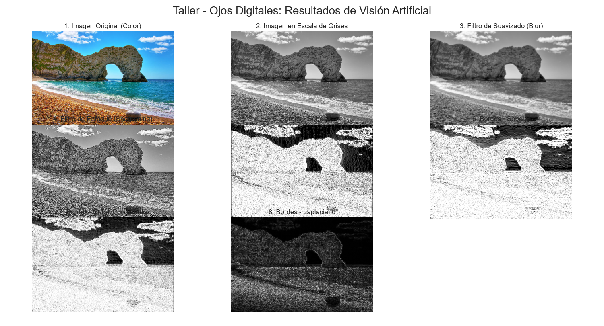

Taller - Ojos Digitales: Introducción a la Visión Artificial 👁️‍🗨️

Este repositorio contiene la solución completa para el taller de introducción a la visión artificial. El objetivo fue explorar los fundamentos del procesamiento de imágenes, incluyendo la conversión de color, la aplicación de filtros convolucionales y la detección de bordes utilizando Python y la librería OpenCV.

Flujo de Procesamiento Implementado ⚙️

El script sigue una secuencia lógica y fundamental en el procesamiento de imágenes para análisis:

    Carga y Preparación: Se inicia cargando una imagen a color desde el disco. Inmediatamente, esta imagen se convierte a escala de grises. Este paso es crucial porque simplifica la imagen de tres canales (RGB) a uno solo (intensidad), lo que optimiza y facilita los cálculos posteriores.

    Filtrado Convolucional:

        Suavizado (Blur): Se aplica un filtro de promediado para reducir el ruido y los detalles finos, obteniendo una versión más "borrosa" de la imagen.

        Enfoque (Sharpening): Se utiliza un kernel de convolución personalizado para realzar las diferencias entre píxeles adyacentes, lo que resulta en una imagen con bordes y texturas más nítidos.

    Detección de Bordes: Se implementan dos técnicas clásicas para identificar las áreas con cambios bruscos de intensidad:

        Filtro de Sobel: Se calcula la primera derivada de la imagen en los ejes X (bordes verticales) y Y (bordes horizontales) para obtener un análisis direccional de los bordes.

        Filtro Laplaciano: Se calcula la segunda derivada para detectar bordes en todas las direcciones de manera simultánea. Este método es especialmente bueno para encontrar detalles finos.

    Visualización Comparativa: Finalmente, todos los resultados (imagen original, en escala de grises, suavizada, enfocada y los mapas de bordes) se despliegan en una única ventana utilizando matplotlib, permitiendo una comparación visual clara y directa de los efectos de cada técnica.

Resultados Visuales 📊

A continuación se muestra una captura del resultado final, donde se comparan todas las imágenes procesadas.

Captura de la Ventana de Resultados:

Este es el tipo de salida que el script genera, mostrando una comparativa completa de cada paso del procesamiento.

Código de la Solución 💻

El proyecto fue desarrollado en un entorno de Python estándar, pero es totalmente compatible con notebooks de Jupyter o Google Colab.

    Código Relevante: A continuación, el script completo de la solución.

Python

import cv2
import numpy as np
import matplotlib.pyplot as plt

# 1. Cargar imagen y convertir a escala de grises
try:
    img_color = cv2.imread('imagen.jpg')
    img_color_rgb = cv2.cvtColor(img_color, cv2.COLOR_BGR2RGB)
    img_gris = cv2.cvtColor(img_color, cv2.COLOR_BGR2GRAY)
except Exception:
    print("No se encontró 'imagen.jpg'. Usando una imagen negra de respaldo.")
    img_color_rgb = np.zeros((400, 600, 3), dtype=np.uint8)
    img_gris = np.zeros((400, 600), dtype=np.uint8)

# 2. Aplicar filtros convolucionales
# Suavizado (Blur)
img_blur = cv2.blur(img_gris, (5, 5))

# Enfoque (Sharpening)
kernel_sharpening = np.array([[-1, -1, -1],
                              [-1,  9, -1],
                              [-1, -1, -1]])
img_sharpened = cv2.filter2D(img_gris, -1, kernel_sharpening)

# 3. Detección de bordes
# Sobel en ejes X e Y
sobel_x = cv2.convertScaleAbs(cv2.Sobel(img_gris, cv2.CV_64F, 1, 0, ksize=5))
sobel_y = cv2.convertScaleAbs(cv2.Sobel(img_gris, cv2.CV_64F, 0, 1, ksize=5))

# Laplaciano
laplaciano_abs = cv2.convertScaleAbs(cv2.Laplacian(img_gris, cv2.CV_64F))

# 4. Visualización comparativa
plt.style.use('seaborn-v0_8-dark')
fig, axs = plt.subplots(2, 3, figsize=(16, 10))
fig.suptitle('Taller - Ojos Digitales: Resultados', fontsize=20)

axs[0, 0].imshow(img_color_rgb)
axs[0, 0].set_title('1. Original a Color')

axs[0, 1].imshow(img_gris, cmap='gray')
axs[0, 1].set_title('2. Escala de Grises')

axs[0, 2].imshow(img_blur, cmap='gray')
axs[0, 2].set_title('3. Suavizado (Blur)')

axs[1, 0].imshow(img_sharpened, cmap='gray')
axs[1, 0].set_title('4. Enfoque (Sharpening)')

axs[1, 1].imshow(sobel_x, cmap='gray')
axs[1, 1].set_title('5. Bordes - Sobel X')

axs[1, 2].imshow(laplaciano_abs, cmap='gray')
axs[1, 2].set_title('6. Bordes - Laplaciano')

for ax in axs.flat:
    ax.axis('off')

plt.tight_layout(rect=[0, 0, 1, 0.96])
plt.show()

✅ Prompts Utilizados

Para generar la solución de código y este README.md, se utilizó un modelo de IA (Gemini) con una serie de prompts. El flujo fue el siguiente:

    Prompt Inicial (Solución del Taller): Se proporcionó el enunciado completo del taller, solicitando una solución en Python que incluyera la carga de imágenes, conversión a escala de grises, aplicación de filtros de suavizado y enfoque, detección de bordes con Sobel y Laplaciano, y la visualización comparativa de los resultados.

Comentarios Personales y Aprendizaje 🧠

Este taller ha sido una excelente introducción práctica al mundo de la visión artificial.

    Principales Aprendizajes:

        La importancia de la conversión a escala de grises como un primer paso fundamental para simplificar el análisis de imágenes.

        El poder de la convolución. Fue fascinante ver cómo una operación matemática tan elegante, al cambiar simplemente una pequeña matriz (el kernel), puede transformar una imagen para suavizarla, enfocarla o detectar características complejas.

        La diferencia conceptual y visual entre los detectores de bordes. Entender que Sobel es direccional (ideal para buscar bordes verticales u horizontales) mientras que Laplaciano es más sensible y general, fue un descubrimiento clave.

    Dificultades Encontradas:

        Al principio, la idea de un "kernel" y cómo la matriz interactúa con los píxeles puede ser un poco abstracta. La experimentación con diferentes valores en el kernel de enfoque fue clave para entenderlo de forma intuitiva.

        La gestión de los tipos de datos en OpenCV (por ejemplo, CV_64F para las derivadas y luego cv2.convertScaleAbs para convertir de nuevo a uint8 para visualización) requiere atención al detalle. Es fácil obtener imágenes negras o extrañas si no se manejan correctamente las conversiones.

        Asegurarse de que las librerías (opencv-python, matplotlib, numpy) estén instaladas y funcionen en la misma versión puede ser un pequeño obstáculo inicial si no se usa un entorno gestionado como Colab.

En general, la experiencia fue muy enriquecedora y demostró que con unas pocas líneas de código se pueden implementar conceptos muy potentes de la visión por computador.