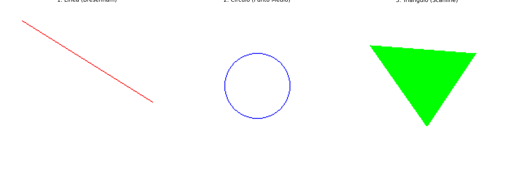

🎨 Taller - Rasterización desde Cero

Este repositorio contiene la implementación en Python de algoritmos clásicos de rasterización para dibujar primitivas gráficas (líneas, círculos y triángulos) desde cero, sin depender de librerías gráficas de alto nivel. El objetivo es comprender cómo se construyen las imágenes píxel a píxel.

📝 Descripción de los Algoritmos

Se implementaron tres algoritmos fundamentales en la computación gráfica:

1. Algoritmo de Bresenham para Líneas

Es un método altamente eficiente para trazar líneas sobre una matriz de píxeles. Su principal ventaja es que utiliza exclusivamente operaciones con números enteros, evitando cálculos con punto flotante. El algoritmo mantiene un término de error en cada paso para decidir cuál de los dos siguientes píxeles está más cerca de la línea ideal, logrando una aproximación visualmente precisa y muy rápida.

2. Algoritmo de Punto Medio para Círculos

Similar a Bresenham, este algoritmo dibuja el perímetro de un círculo usando solo aritmética de enteros. Para cada paso, calcula la posición de un punto medio entre dos posibles píxeles y, basándose en si este punto queda dentro o fuera del círculo ideal, elige el píxel a dibujar. Aprovecha la simetría de 8 octantes de un círculo, lo que significa que solo necesita calcular los píxeles de un arco de 45° para poder trazar el círculo completo.

3. Relleno por Scanline para Triángulos

Este es un método para rellenar polígonos. Funciona recorriendo la figura línea por línea horizontalmente (scanline). Para cada "scanline" que cruza el triángulo, el algoritmo calcula las intersecciones con sus aristas. Luego, simplemente dibuja una línea horizontal entre los puntos de intersección de la izquierda y la derecha, rellenando eficientemente el área interior.

🖼️ Resultados Visuales

A continuación se muestran las imágenes generadas por los algoritmos.

Todas las formas en un solo lienzo:

💻 Código Relevante

Estos son los fragmentos de código clave para cada algoritmo implementado.

bresenham()

Python

def bresenham(pixels, x0, y0, x1, y1):
    dx = abs(x1 - x0)
    dy = abs(y1 - y0)
    sx = 1 if x0 < x1 else -1
    sy = 1 if y0 < y1 else -1
    err = dx - dy
    
    while True:
        if 0 <= x0 < 200 and 0 <= y0 < 200:
            pixels[x0, y0] = (255, 0, 0) # Rojo
        if x0 == x1 and y0 == y1:
            break
        e2 = 2 * err
        if e2 > -dy:
            err -= dy
            x0 += sx
        if e2 < dx:
            err += dx
            y0 += sy

midpoint_circle()

Python

def midpoint_circle(pixels, x0, y0, radius):
    x = radius
    y = 0
    p = 1 - radius
    
    while x >= y:
        # Dibuja los 8 octantes simétricos
        for dx, dy in [(x, y), (y, x), (-x, y), (-y, x), (-x, -y), (-y, -x), (x, -y), (y, -x)]:
            if 0 <= x0 + dx < 200 and 0 <= y0 + dy < 200:
                pixels[x0 + dx, y0 + dy] = (0, 0, 255) # Azul
        y += 1
        if p <= 0:
            p = p + 2*y + 1
        else:
            x -= 1
            p = p + 2*y - 2*x + 1

fill_triangle()

Python

def fill_triangle(pixels, p1, p2, p3):
    pts = sorted([p1, p2, p3], key=lambda p: p[1])
    (x1, y1), (x2, y2), (x3, y3) = pts

    def interpolate(y_start, y_end, x_start, x_end):
        if y_end == y_start: return []
        slope = (x_end - x_start) / (y_end - y_start)
        return [int(x_start + slope * (y - y_start)) for y in range(y_start, y_end)]

    x12 = interpolate(y1, y2, x1, x2)
    x23 = interpolate(y2, y3, x2, x3)
    x13 = interpolate(y1, y3, x1, x3)
    
    x_left = x12 + x23
    x_right = x13

    for y in range(y1, y3):
        idx = y - y1
        xl = x_left[idx]
        xr = x_right[idx]
        for x in range(min(xl, xr), max(xl, xr) + 1):
            if 0 <= x < 200 and 0 <= y < 200:
                pixels[x, y] = (0, 255, 0) # Verde

🤔 Reflexión y Comparativa

¿Qué diferencias hay entre los métodos?

La diferencia fundamental radica en su propósito y estrategia.

    Bresenham y Punto Medio son algoritmos de trazado de bordes. Su lógica se centra en seguir el contorno de una forma ideal.

    Scanline es un algoritmo de relleno de área. No le interesa el borde, sino el espacio interior, el cual llena de manera sistemática y horizontal.

    Mientras Bresenham se adapta a una geometría lineal, el de Punto Medio está optimizado para la geometría circular, explotando su simetría para reducir drásticamente los cálculos.

¿Cuáles son más rápidos o precisos?

    Rapidez: Todos los algoritmos implementados son extremadamente rápidos porque evitan operaciones costosas (como multiplicaciones con decimales, divisiones o raíces cuadradas) dentro de sus bucles principales. Se basan en sumas, restas y desplazamientos de bits (multiplicar por 2), que son las operaciones más rápidas para una CPU. No se puede decir que uno sea inherentemente más rápido que otro, ya que resuelven problemas distintos. Sin embargo, para sus respectivas tareas, son soluciones de rendimiento óptimo.

    Precisión: En el contexto de una cuadrícula de píxeles, estos algoritmos son "perfectamente imprecisos". Son "precisos" en el sentido de que eligen la secuencia de píxeles óptima para representar una forma en un espacio discreto. Sin embargo, son "imprecisos" porque el resultado siempre será una aproximación de la forma matemática ideal. Esta limitación es la que causa el efecto de "dientes de sierra" o aliasing. Para obtener un resultado visual más suave, se requerirían técnicas de antialiasing, que calculan tonalidades de color intermedias para simular una mayor resolución, aunque a costa de un mayor coste computacional.