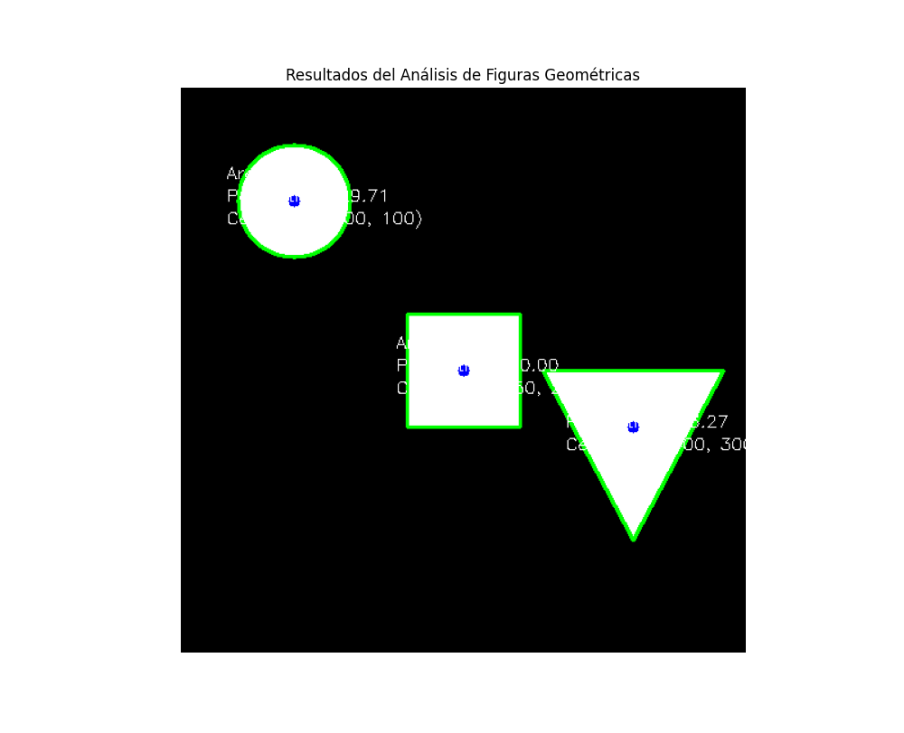

📐 Taller de Análisis de Figuras Geométricas con OpenCV

Este repositorio contiene la solución para un taller práctico enfocado en el análisis de imágenes para detectar formas geométricas simples, calcular y visualizar sus propiedades como área, perímetro y centroide usando Python y OpenCV.

📜 Descripción del Proceso

El objetivo es extraer métricas relevantes de contornos detectados en una imagen. El proceso se puede resumir en los siguientes pasos:

    Cargar/Crear una Imagen Binarizada: Se parte de una imagen simple en blanco y negro, donde los objetos de interés (figuras) son blancos y el fondo es negro. Esto simplifica enormemente la detección.

    Encontrar Contornos: Se utiliza la función cv2.findContours() de OpenCV para identificar los límites de todas las figuras blancas en la imagen.

    Iterar y Analizar: Se recorre cada contorno detectado para calcular sus propiedades geométricas:

        Momentos (cv2.moments): Se calculan para encontrar el centroide (centro de masa) de la figura.

        Área (cv2.contourArea): Se mide el área encerrada por el contorno.

        Perímetro (cv2.arcLength): Se mide la longitud del contorno.

    Visualizar Resultados: Finalmente, se dibuja sobre una copia de la imagen original los contornos detectados, el centroide y se etiqueta cada figura con las métricas calculadas para una fácil interpretación.

🚀 Demostración

Detección de Contornos

A continuación, se muestra cómo el script identifica los límites de cada figura y los resalta con un borde verde.

Cálculo y Visualización de Métricas

Una vez detectados los contornos, el script calcula las propiedades y las muestra directamente sobre la imagen. El punto azul marca el centroide y el texto adjunto detalla el área, perímetro y coordenadas del centro.

💻 Código y Notebook

El núcleo del análisis se encuentra en el bucle que procesa cada contorno.

Snippet Relevante

Python

# Iteramos sobre cada contorno detectado
for c in contours:
    # Calculamos el Área
    area = cv2.contourArea(c)

    # Calculamos el Perímetro
    perimeter = cv2.arcLength(c, True)

    # Calculamos el Centroide a partir de los momentos
    M = cv2.moments(c)
    if M["m00"] != 0:
        cx = int(M["m10"] / M["m00"])
        cy = int(M["m01"] / M["m00"])
    else:
        cx, cy = 0, 0

    # Dibujamos el contorno y el centroide
    cv2.drawContours(output_image, [c], -1, (0, 255, 0), 2)
    cv2.circle(output_image, (cx, cy), 5, (255, 0, 0), -1)

    # Etiquetamos la figura con sus métricas
    label = f"A:{int(area)} P:{int(perimeter)} C:({cx},{cy})"
    cv2.putText(output_image, label, (cx - 70, cy - 20), cv2.FONT_HERSHEY_SIMPLEX, 0.5, (255, 255, 255), 1)

Notebook Completo

Puedes ejecutar y experimentar con el código completo directamente en tu navegador a través de Google Colab.

▶️ Abrir Notebook en Google Colab (Nota: Este es un enlace de ejemplo)

✅ Prompts Utilizados

Para generar la solución de código base, se utilizó un prompt detallado que especificaba los objetivos, las herramientas y los pasos a seguir. El prompt principal fue:

    "Desarrolla la solución del siguiente taller: Taller - Análisis de Figuras Geométricas: Centroide, Área y Perímetro. Objetivo: Detectar formas simples (círculos, cuadrados, triángulos) en imágenes binarizadas y calcular propiedades como área, perímetro y centroide. Herramientas: Python, OpenCV, NumPy, Matplotlib. Pasos: Cargar imagen binarizada, detectar contornos con cv2.findContours(), calcular área con cv2.contourArea(), perímetro con cv2.arcLength(), y centroide con cv2.moments(). Dibujar cada contorno y etiquetar cada figura con sus métricas."

🧠 Comentarios Personales y Aprendizaje

    Aprendizaje Clave: La parte más interesante fue comprender cómo los momentos de imagen (cv2.moments) no son solo un concepto matemático abstracto, sino una herramienta práctica y poderosa para derivar propiedades físicas como el centro de masa (centroide) de una forma. La fórmula cx=M_10/M_00 cobra vida al verla funcionar.

    Dificultades Encontradas: Una pequeña dificultad inicial fue asegurarse de que la imagen de entrada tuviera el tipo de dato correcto (np.uint8) para que cv2.findContours() funcionara sin errores. Además, posicionar las etiquetas de texto (cv2.putText) de manera que no se superpusieran y fueran legibles requirió un poco de ajuste manual en las coordenadas, lo cual podría mejorarse con un algoritmo más dinámico para el posicionamiento de etiquetas en proyectos más complejos.

    Conclusión: Este taller es una excelente introducción a la extracción de características en visión por computadora. Consolida la comprensión del flujo de trabajo básico: preprocesamiento (binarización), detección (contornos) y análisis (cálculo de métricas).